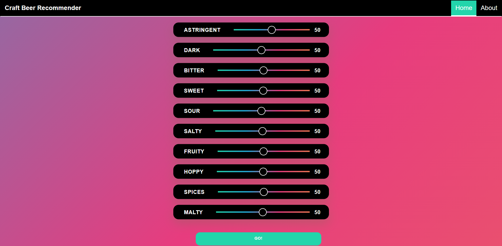
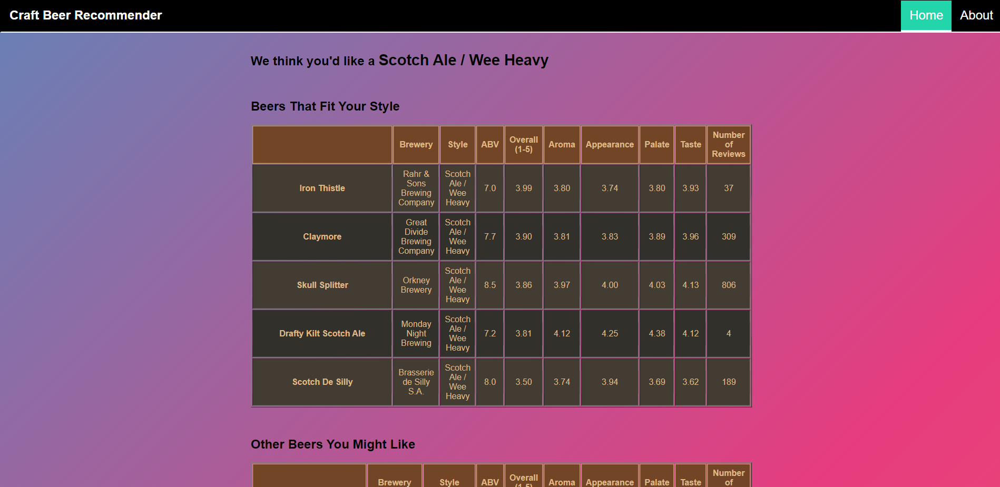

# Beer Recommender

  

# Overview

The market for craft beer in the U.S. continues to grow, and consumers’ willingness to spend more for variety, flavor and quality has only increased since independent brewing, as we know it, took shape in the 1960s. Craft beer typically features higher quality ingredients, providing beer-drinkers with a more distinct and flavorful beer than mass-produced options. Those reaching for a craft beer want to try something different and new. The number of independent breweries operating in the U.S. reached an all-time high in 2021, with 9,118 different locations producing their own brew ([Brewers Association](https://www.brewersassociation.org/statistics-and-data/national-beer-stats/)). For perspective, there were only about 13,000 McDonald's locations nationwide that same year ([Statista](https://www.statista.com/statistics/256040/mcdonalds-restaurants-in-north-america/)), and there are currently just 3,062 Chipotle locations in the United States ([ScrapeHero](https://www.scrapehero.com/location-reports/Chipotle-USA/)). So yeah, people like their beer. 

But with so many beers and breweries to choose from, finding the right beer can seem daunting, and even a little hopeless. That's where we come in. Our goal is to answer everyone's first question when they get to the bar or the beer aisle, "What should I get?" To do so, we are developing a Beer Recommendation app, using this [Beer Profile and Ratings Data Set](https://www.kaggle.com/datasets/ruthgn/beer-profile-and-ratings-data-set), to find the perfect beer for you based on your taste preferences. Featuring taste profiles and consumer reviews for over 3000 unique beers and 934 different breweries, we are confident we can find you the right brew.
 

Cheers.
  

# Team Members:

  

## - Jack Moletteire
## - Timothy Malasky
## - Souleymane Ndiaye
  

# Software and Technologies
•   Python 3.10.8

•  SQLite

•  Pandas 1.3.5

•  Scikit-Learn 1.0.2

•  TensorFlow 2.11.0

•  Tableau Public 

•  HTML

•  CSS
  

# Resources

• Dataset -> [updated_beer_profile_and_ratings.csv](https://github.com/Tmalasky/Beer_Recommender/files/9914763/updated_beer_profile_and_ratings.csv) 
• Recommendation System Inspiration -> [Creating a Beer Recommender (GitHub)](https://github.com/ruthgn/Beer-Recommender) + [Kaggle Link](https://www.kaggle.com/code/ruthgn/creating-a-beer-recommender-deployment)
  

### ERD

  

# Questions

  

### 1.) What style of beer is most popular based on data from consumers?
### 2.) Which flavor profile is most popular based on the dataset?
### 3.) Which breweries have the most highly-rated beers based on user reviews?
### 4.) What type of beer might you prefer based on your own taste preferences?
  

# Answers
[Tableau Visual Graphs](https://public.tableau.com/app/profile/tim6081/viz/Final_Project_16681028326290/Most_popular_flavor_profile?publish=yes)

### 1.) Top 25 Most Popular Beers

### 2.) Top 25 Most Popular Styles of Beer

### 3.) Top 25 Most Popular Breweries

### Craft Beer Recommender

  

  

  

# About the Model

  

We are using a multi-class classification model that analyzes user preferences to determine
preferred beer style and make recommendations.
  

## Feature Selection
Preliminary analysis and preprocessing involved analyzing variables (e.g., ABV, min./max. IBU, taste profile, review data, etc.) and grouping related data. A SQLite
database was created to store several tables of related information such as taste data, review scores,
and names & breweries, creating a more organized source. 

After building the database, there was further discussion about the direction of the project, at which point
we decided the model would only learn from objective*, numerical data. This meant only taste profile
(e.g., Astringency, Bitterness, Saltiness, etc.) and chemical composition (ABV, min./max. IBU) would be considered
in the construction of the model, while review data and identifying information would be excluded. The choice was 
made with the belief that a model based on factual data would provide more significant output than one that considered 
opinionated statistics like review scores, which we believed were more volatile, and susceptible to outliers. 

_*Taste profile, while not an exact science, is based on word counts from descriptions and user reviews, 
with "the assumption that people writing reviews are more than likely describing what they do experience rather 
than what they do not. (Kaggle)" As such, we believe it is more reliable than arbitrarily assigned review scores._
  

## Preprocessing & Initial Construction
Data was imported from the SQLite database and stored in Pandas dataframes. Taste and chemical data (our features) were
then standardized using SciKit-Learn's MinMaxScaler. However, because taste values were calculated based on absolute word counts 
originating from user reviews of various lengths, the ranges of values for these columns varies widely, and 
inconsistently, between beers. Thus, we had to scale values across each row (beer) before applying the scaler across columns 
(features) for more consistent scaling. 

Once scaled, data was split into training and testing sets with a standard 75/25 split. Additionally, target data (in this case,
encoded categorical beer style data), was stratified to avoid misrepresentation of styles in either set. 

With the data finally prepped, a model could be constructed and trained. The model was initially built with two layers and less than 
10 total neurons; this simple algorithm purposed as a guinea pig, ensuring features were correctly standardized, encoded, and
split. After some trial and error, a model with three layers and 35 total neurons (15, 12, and 8, in each hidden layer, respectively), trained for 200 epochs,
proved about as accurate as possible given 38 possible outcomes, correctly predicting style of beer ~60% of the time. Additional neurons and layers proved negligible, while more epochs led
to over-fitting.  

## Activation Functions
Given a multi-class classification problem (where the model must determine probability of class membership) solved using 
a Multilayer Perceptron (MLP) model, and standardized input data that contains no negative values, it made the most sense 
for each hidden layer to use a ReLU activation function while the output layer used a Softmax output activation function. 

A ReLU activation function made the most sense for our hidden layers given its synergy with the MLP model, its computational simplicity (no need for exponential calculations leads to cheaper computations),
and its efficiency in training a deep network on large, labeled datasets. While in our output layer, the softmax function outputs a vector of values that sum to 1.0, with each value representing a probability of class membership, 
which was perfect for our problem.
  

## Similar Beers with K-Neighbors
Once the style of beer could be determined, we implemented a KNN algorithm to find the 5 most similar beers based on taste profile, filtering the data for beers of the same style and of other styles, respectively, for a total of 10 recommendations (5 of same style, 5 of other styles). Then, using a ball tree algorithm, beers were clustered based on their attributes, allowing us to search those clusters with user input until we found a close enough match.
